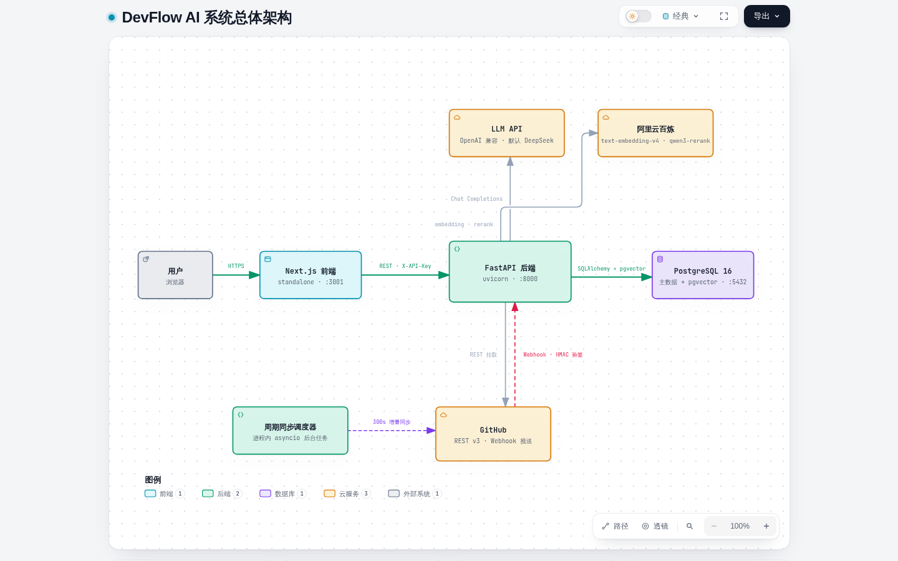
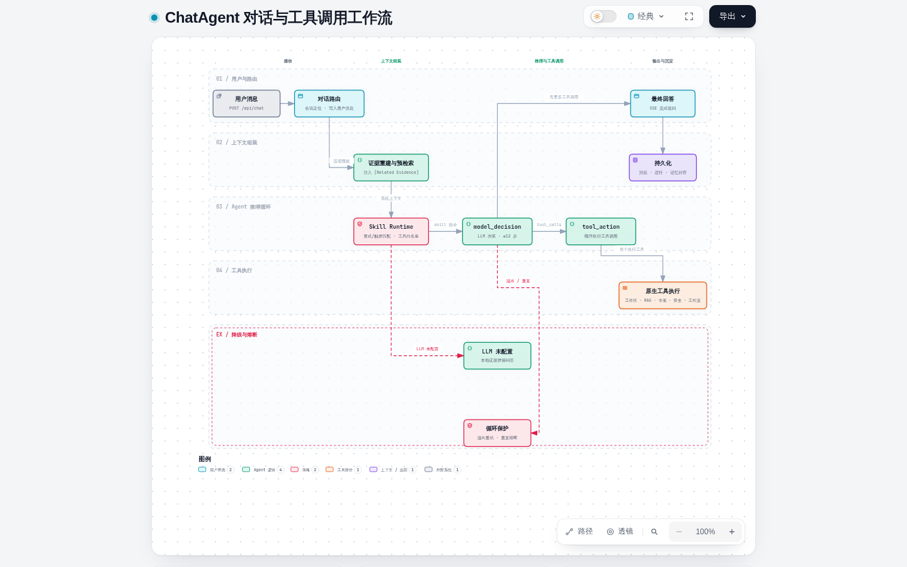
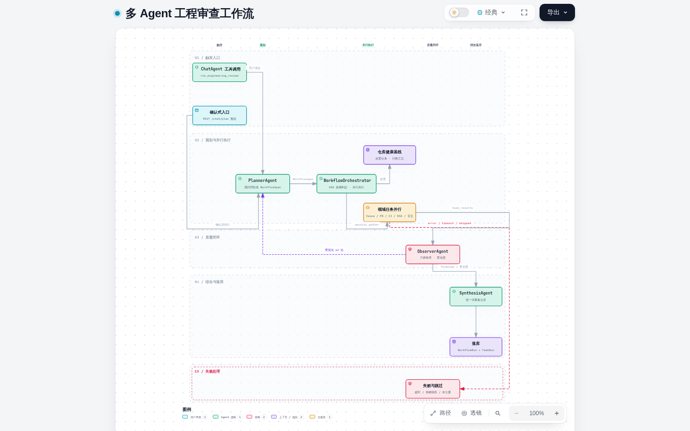
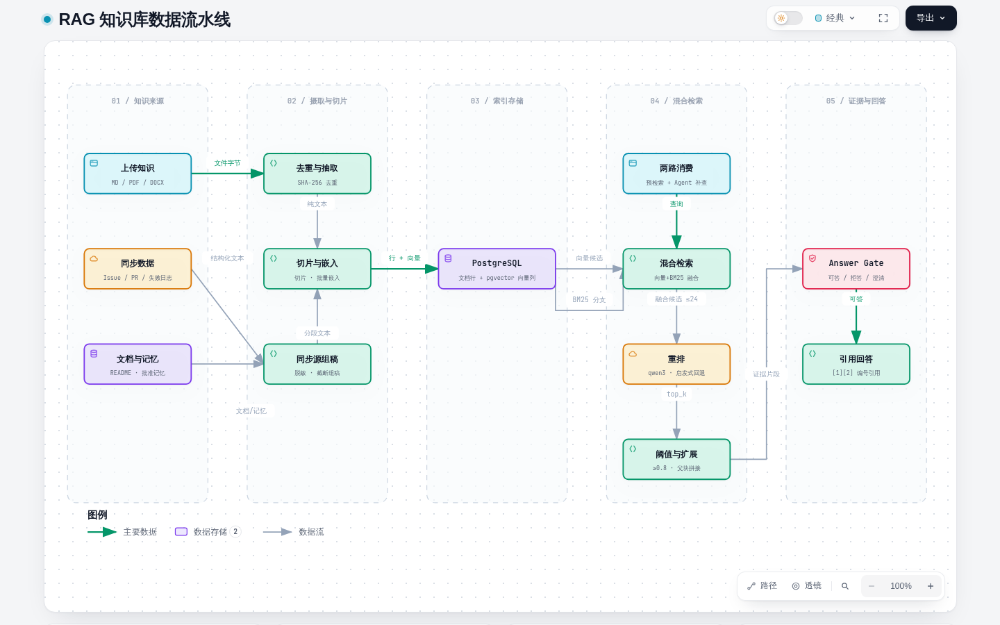
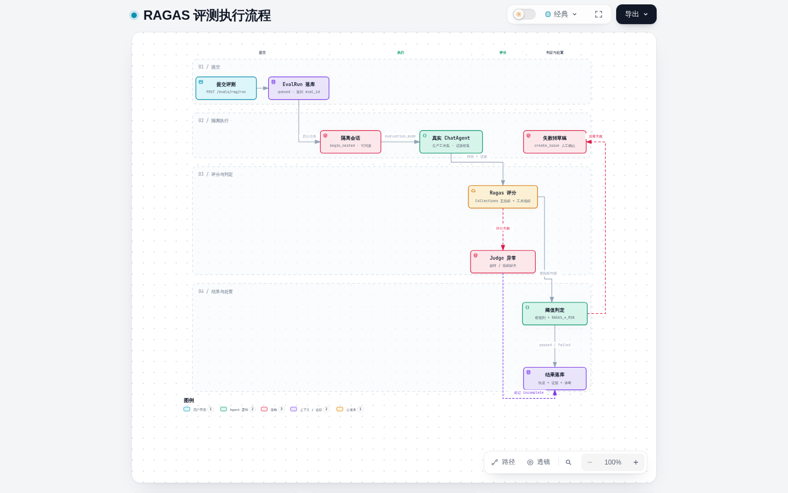
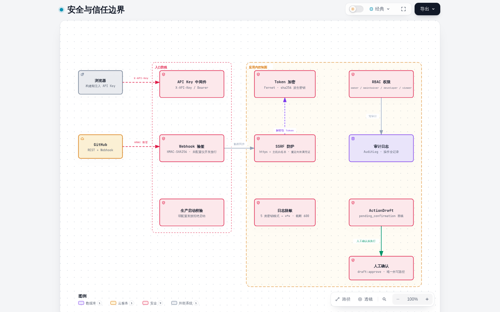

# DevFlow AI

DevFlow AI 是一个面向 GitHub PR / Issue 研发协作的全栈 AI Agent 系统。它连接仓库数据，分析 Issue、PR diff、CI 日志、项目知识库和本地工作区代码，返回结构化建议与安全的操作草稿——所有对外写入都必须经过人工确认。

> 📊 本仓库的 [`架构图/`](架构图/index.html) 目录内含 **12 张可交互架构图**（深浅主题 / 搜索 / 聚焦 / 导出），经 archify showcase 四道质量门校验，覆盖系统总览与全部关键子系统。

## 核心功能

- **仓库连接与同步**：接入 GitHub 仓库后自动同步 Issue、Pull Request、PR 文件、Review 评论、Workflow Run、Job 与失败日志；300 秒周期调度 + Webhook 事件双通道触发。
- **Issue 分析**：分类、优先级、复杂度、推荐负责人、重复候选与行动项。
- **PR 审查**：摘要、关键变更、风险点、P1-P3 分级 findings、检查清单与测试建议。
- **CI 排障**：失败类型、可能原因、排查步骤与相关上下文。
- **Agent 对话**：`ChatAgent` 以原生工具调用串联 14 个工具——工作区代码（列文件/读文件/搜索）、RAG 检索、专项分析、安全分类、工程审查工作流与 MCP 记忆工具。
- **多 Agent 工程审查**：`WorkflowOrchestrator` 构建 Planner → 专用 Agent → Observer → Synthesis 闭环，处理 PR 就绪度、阻塞项与跨领域工程决策，支持 ≤2 轮重规划。
- **Skill Runtime**：按显式指定或触发条件选择 `SKILL.md`，限定工具白名单，把版本与激活原因写入 trace。
- **RAG 知识库**：文档解析、段落感知切片、向量 + BM25 混合检索、qwen3-rerank 重排、Answer Gate 门禁与编号引用回答；源码不入向量库，走工作区实时检索。
- **RAGAS 评测**：隔离会话真实运行生产 ChatAgent，五项语义指标 + 硬规则门禁，支持异常重评与回归对比。
- **安全闭环**：API Key 鉴权、Token 加密存储、SSRF 白名单、日志脱敏；所有 GitHub 写操作只生成 ActionDraft，人工确认后才执行。

## 系统架构



（交互版：[`架构图/01-overview/system-architecture.html`](架构图/01-overview/system-architecture.html)）

- **前端**：Next.js App Router（standalone 输出），Workspace 对话首页 + 知识库 / RAG 工作室 / 评测中心等 9 个页面，统一 API 客户端注入 `X-API-Key` 并解析 SSE 流。
- **后端**：FastAPI 单进程——ApiKey + CORS 中间件 → 18 个路由 → 领域服务（Agent / RAG / 记忆上下文 / 同步索引）→ 基础设施客户端（LLM / GitHub / MCP 子进程 / SQLAlchemy）。启动时执行 Alembic 迁移并拉起周期同步任务。
- **数据层**：**PostgreSQL 16 是唯一持久化存储**——业务数据与 RAG 向量同库：pgvector 扩展 + `documents.embedding` 列（HNSW 余弦索引），无独立向量数据库。
- **外部服务**：GitHub REST + Webhook；OpenAI 兼容 LLM（默认 DeepSeek）；阿里云百炼 embedding 与 qwen3-rerank。

### 关键子系统

| 子系统 | 图示 |
|---|---|
| ChatAgent 对话与工具调用循环 |  |
| 多 Agent 工程审查（Planner → 并行任务 → Observer → Synthesis） |  |
| RAG 数据流水线（来源 → 切片嵌入 → 混合检索 → 门禁生成） |  |
| RAGAS 评测（隔离执行 → 评分 → 阈值判定） |  |
| 安全与信任边界（入口防线 / 凭证控制 / 人工确认外写闭环） |  |

全部 12 张图（含文档状态机、EvalRun 状态机、仓库同步、数据模型、前端结构等）见 **[架构图集索引](架构图/index.html)**，每张附源码文件级证据链接。

## 技术栈

- **后端**：Python 3.12（uv 管理依赖，`pyproject.toml` + `uv.lock` 锁定）、FastAPI、Pydantic v2、SQLAlchemy 2、Alembic、PostgreSQL 16 + **pgvector**、httpx、LangChain/LangGraph（原生工具调用）。
- **RAG**：pgvector HNSW 余弦检索 + PostgreSQL BM25 加权融合（0.62/0.30/0.08）+ qwen3-rerank 重排 + Answer Gate。
- **前端**：Next.js（standalone）、TypeScript、Tailwind CSS。
- **基础设施**：Docker Compose 三服务（`pgvector/pgvector:pg16` + 后端 + 前端）；GitHub Actions CI（后端 225 项 pytest + 前端 lint/build）。

## 快速开始（Docker 全栈）

```bash
# 1. 生成配置：所有密钥用 openssl rand -hex 16 生成，填入 LLM_API_KEY / DASHSCOPE_API_KEY
cp .env.example .env

# 2. 构建并启动全部服务（pgvector PostgreSQL + 后端 + 前端）
docker compose up -d --build
```

默认地址：

- 前端：http://localhost:3001
- 后端：http://localhost:8000
- API 文档：http://localhost:8000/docs
- PostgreSQL（本机调试）：`localhost:5433`

所有服务仅绑定 127.0.0.1；前端映射 3001、PostgreSQL 调试端口映射 5433（3000/5432 在多数开发机上已被占用）。

### API Key 鉴权

`.env` 中设置了 `DEVFLOW_API_KEY` 时，所有 `/api/*` 请求必须携带 `X-API-Key` 头（`/health`、`/docs` 与 webhook 豁免）。前端镜像在构建时注入该 Key；修改 Key 后需要重建前端镜像：`docker compose up -d --build frontend`。后端配置变更只需 `docker compose up -d --force-recreate backend`。

### 宿主机开发模式

```bash
# 基础设施用 Docker
docker compose up -d postgres

# 后端（uv 管理 Python 依赖）
cd backend
uv sync                # 本地 Qwen Embedding：uv sync --extra local-embedding
uv run uvicorn app.main:app --reload

# 前端
cd frontend
npm install
npm run dev            # http://localhost:3000
```

数据库迁移由后端启动时的 Alembic 自动执行（`alembic upgrade head`，advisory lock 防多 worker 并发）；手动执行：`cd backend && uv run alembic upgrade head`。

## RAG 知识问答

- 支持格式：TXT、Markdown、PDF、DOCX、JSON、CSV 与日志文件；重复文件按 SHA-256 跳过。
- **来源策略**：进入 RAG 的只有需要跨来源语义召回的非结构化知识（Issue 描述、PR 讨论与 Review 评论、失败 CI 日志、项目文档、上传知识、批准记忆）；**当前源码不入向量库**，以当前 checkout 为准走 `workspace.search_code` / `read_file` 实时检索；Issue/PR/CI 状态等结构化数据直接查数据库。
- **混合检索**：pgvector 余弦召回与 BM25 全库检索加权融合（0.62/0.30 + 0.08 双路命中加成），近重复去重、同父文档限流，qwen3-rerank 重排（失败回退启发式），默认 0.6 分数阈值按 rerank 分数刻度校准。
- **Answer Gate**：无证据、强信号未命中、证据极性对立或问题模糊时分别拒答/澄清，绝不无证据作答；回答带 `[1][2]` 编号引用。
- **对话链路双检索**：调用 ChatAgent 前 `ContextAssembler` 按原始问题预检索注入证据；推理循环内模型可改写查询经 `rag.search_similar_documents` 连续补查并交叉验证。
- Embedding 默认 DashScope `text-embedding-v4`（1024 维）；全部仓库共享同一向量空间，契约不一致直接报错。本地 Qwen Embedding 安装 `uv sync --extra local-embedding` 后可用。

常用 API（完整以 http://localhost:8000/docs 为准）：

```text
POST /api/rag/repositories                      # 创建知识库
POST /api/rag/repositories/{repo_id}/documents  # 上传文档（202 异步）
GET  /api/rag/{repo_id}/status                  # 含 vector_store（pgvector）状态
POST /api/rag/{repo_id}/search                  # 混合检索
POST /api/rag/{repo_id}/ask                     # 证据引用问答
POST /api/rag/{repo_id}/reindex                 # 重建索引（按批重算向量，可断点重跑）
```

> 从旧版本（独立向量库）升级后，请对每个知识库调用一次 `POST /api/rag/{repo_id}/reindex` 重建向量。

## ChatAgent RAGAS 评测

打开 http://127.0.0.1:3001/evals，选择仓库、评测集与 Top-K 运行固定 RAGAS 评测。评测在隔离会话（savepoint 可回滚）中真实运行生产 ChatAgent 与全套工具，计算 Context Precision / Recall、Faithfulness、Answer Relevancy、Agent Goal Accuracy 五项门禁指标。执行状态与质量状态分离：Judge 失败是评测不完整，不会被伪装成质量结论。失败 Case 可展开诊断、仅重试异常评分（不重跑 ChatAgent）、做回归对比，或一键生成 `create_issue` 草稿进入人工确认。

```http
POST /api/evals/rag/run
{ "repo_id": "<uuid>", "run_judge": true, "top_k": 5, "suite_id": "devflow-real-project-rag-baseline" }
```

## 项目结构

```text
backend/
  app/
    api/routes/       # 18 个路由模块（repos/chat/rag/evals/...）
    core/             # 配置、API Key 中间件、加密、脱敏
    db/               # SQLAlchemy 模型（32 张表）与会话
    services/
      agents/         # ChatAgent、WorkflowOrchestrator、专项 Agent
      rag/            # 切片、嵌入、混合检索、重排、Answer Gate、pgvector 存储
      evals/          # RAGAS 运行器与评测套件
      github/         # REST 客户端（白名单 + 凭证剥离）
    skills/           # 6 个 SKILL.md
  alembic/            # 迁移（0001 幂等基线 / 0002 pgvector）
frontend/             # Next.js App Router 页面与 API 客户端
架构图/                # 12 张交互式架构图 + 索引导航
scripts/              # pgvector 初始化 SQL、演示脚本、种子数据
docs/                 # 架构文档与 README 嵌图
```

## 安全设计

- 生产环境强校验：缺 `DEVFLOW_API_KEY`、`TOKEN_ENCRYPTION_KEY` 为默认值或缺 `GITHUB_WEBHOOK_SECRET` 时拒绝启动。
- GitHub Token Fernet 加密落库，运行时按需解密；全局 token 只发给 `api.github.com`，跨主机重定向剥离凭证。
- Webhook HMAC-SHA256 验签；比较一律 `hmac.compare_digest`；日志按 5 类密钥模式脱敏。
- 所有对外写入唯一路径：SafetyAgent → ActionDraft（`pending_confirmation`）→ 人工确认（`draft:approve` 权限）→ GitHub 执行，全程审计。

## License

MIT
